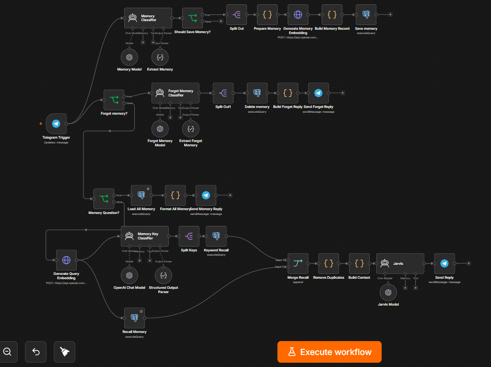
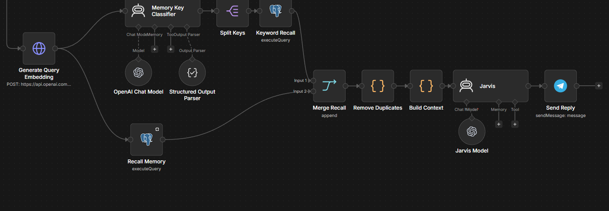
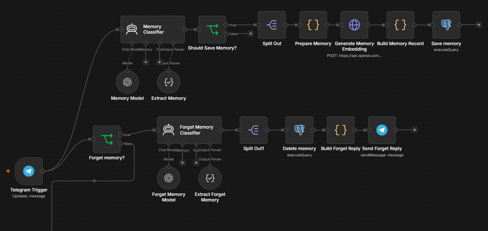
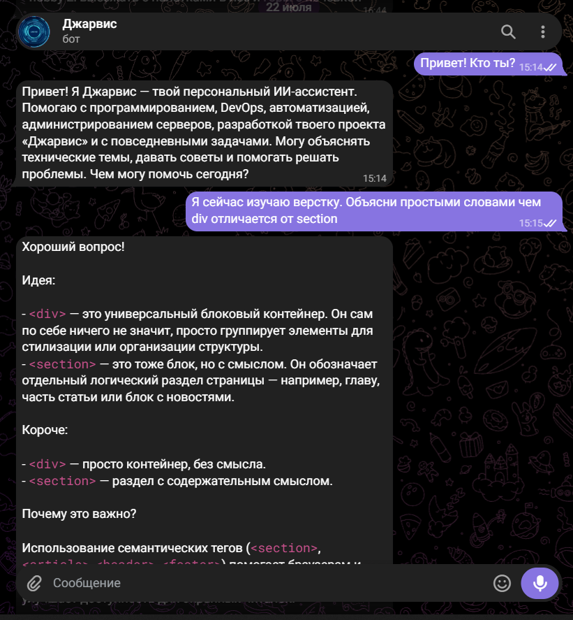
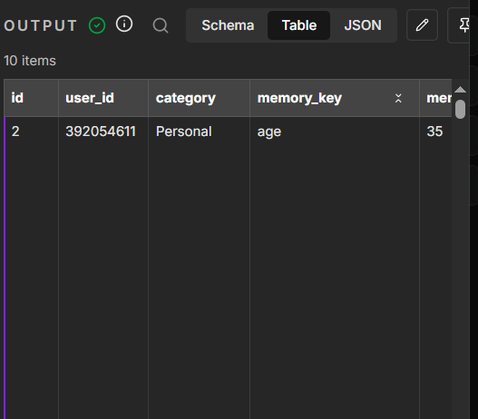

# JARVIS

> Модульная AI-платформа для создания персонального интеллектуального ассистента с долговременной памятью, автоматизацией процессов и интеграцией современных языковых моделей.

---

## О проекте

JARVIS — мой основной pet-проект, в котором я изучаю и применяю современные технологии искусственного интеллекта на практике.

Проект разрабатывается как персональный AI-ассистент с модульной архитектурой. Основная цель — создать систему, способную помнить пользователя, понимать контекст диалога, автоматизировать задачи и легко расширяться новыми возможностями.

---

# Возможности

- Долговременная память пользователя
- Семантический поиск воспоминаний (pgvector)
- AI-классификация новой информации
- Добавление новых воспоминаний
- Удаление воспоминаний
- Контекстные ответы с использованием памяти
- Telegram-интерфейс
- Автоматизация на базе n8n
- Интеграция с OpenAI API

---

# Скриншоты

## Общая архитектура



---

## Основной сценарий обработки сообщений



---

## Система долговременной памяти



---

## Работа через Telegram



---

## Хранение памяти пользователя



---

# Используемые технологии

| Категория | Технологии |
|-----------|------------|
| AI | OpenAI GPT-4.1 Mini |
| Автоматизация | n8n |
| База данных | PostgreSQL 17 + pgvector |
| Backend | JavaScript |
| Контейнеризация | Docker |
| Сервер | Ubuntu Server 24.04 |
| Web Server | Caddy |
| Контроль версий | Git + GitHub |

---

# Структура проекта

```text
JARVIS/

├── architecture/
├── assets/
├── automation/
├── docs/
├── docker/
├── prompts/
├── scripts/
├── src/
├── storage/
└── tests/
```

---

# Планы развития

- Голосовой интерфейс
- Web-интерфейс
- AI Health Assistant
- AI Business Assistant
- Работа с документами
- Vision-модуль
- Локальные модели (Ollama)
- MCP
- Интеграция с внешними сервисами

---

# Статус

🟢 Проект находится в активной разработке.

---

# Автор

**Алексей Хорьяков**

Системный администратор, развивающийся в направлении AI Engineering, автоматизации и разработки интеллектуальных ассистентов.